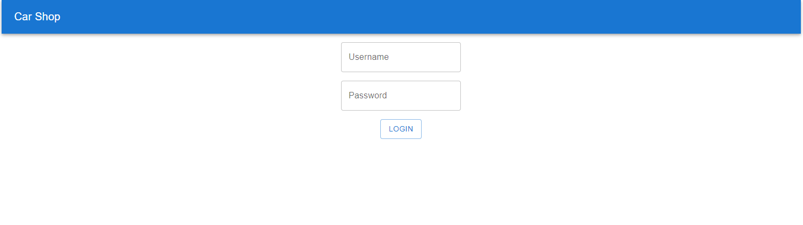

# Car-shop

Aplicación web para gestionar una tienda de autos.


## Features

- CRUD de autos
- Login de usuarios


## Tech Stack

**Client:** 
- React + Typescript
- Axios
- React Query
- Material UI
- Vitest

**Server:** 
- Java (Gradle) + Springboot
- JWT
- Swagger
- JUnit + Mockito


## Installation

Para instalar las dependencias del front:

```bash
  cd carfront
  npm install
```
    
## Deployment

Para ejecutar la aplicación

```bash
  npm run dev
```

## Screenshots


